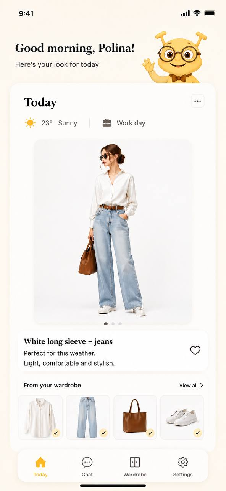

# Closy

AI-native wardrobe companion — an AI stylist that knows your wardrobe and helps you decide what to wear.

## Features

**MVP-0 (implemented)**

- Upload your wardrobe — camera or photo library, with preview before saving
- AI-detected clothing type & color for each item
- Chat with your AI stylist — wardrobe-aware responses via the Gemini API

**Planned**

- Daily outfit recommendations
- Weather integration
- Outfit visualization

## Tech Stack

Frontend

- React Native
- Expo (Expo Router)

Backend

- Node.js
- TypeScript
- Express

Database

- PostgreSQL

Storage

- Supabase Storage

AI

- Gemini API

## Project Docs

- [PRODUCT.md](PRODUCT.md) — vision & product philosophy
- [SPEC.md](SPEC.md) — MVP-0 scope & acceptance criteria
- [TASKS.md](TASKS.md) — task breakdown & progress
- [CLAUDE.md](CLAUDE.md) — development workflow rules

## Status

MVP-0 complete — Wardrobe upload and AI Stylist Chat working end-to-end on iOS/Android via Expo Go.
