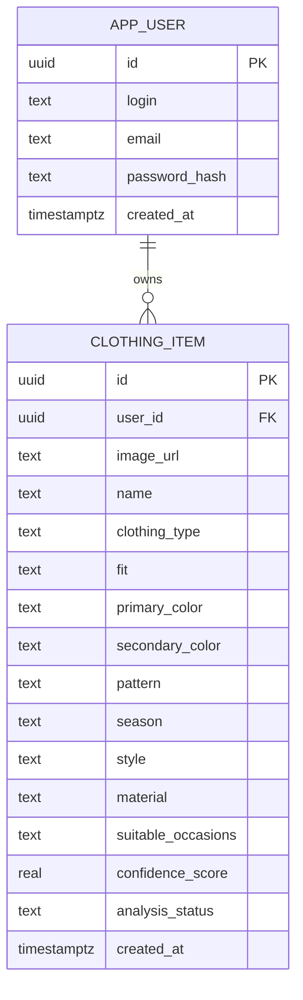

# Data Model

Current PostgreSQL schema (see [schema.ts](../backend/src/db/schema.ts)) and how the tables relate.

---

## Tables

### `app_user`

One row per account. No real authentication yet — `login` alone identifies the account (see [SPEC.md v0.6.0](SPEC.md)).

| Column | Type | Notes |
|---|---|---|
| `id` | UUID | Primary key, generated |
| `login` | TEXT | Unique, case-insensitive (`app_user_login_lower_idx`) |
| `email` | TEXT, nullable | Unused for now |
| `password_hash` | TEXT, nullable | Unused for now — never a raw password |
| `created_at` | TIMESTAMPTZ | Defaults to `now()` |

### `clothing_item`

One row per uploaded piece of clothing. Belongs to exactly one `app_user`.

| Column | Type | Notes |
|---|---|---|
| `id` | UUID | Primary key, generated |
| `user_id` | UUID, nullable | FK → `app_user.id`. Owner of the item |
| `image_url` | TEXT | Relative path (e.g. `/uploads/<file>`); resolved to a full URL by prefixing `PUBLIC_ASSET_BASE_URL` at read time |
| `name` | TEXT, nullable | AI-generated or user-edited display name |
| `clothing_type` | TEXT, nullable | e.g. "T-shirt", "Jeans" |
| `fit` | TEXT, nullable | e.g. "Slim Fit" |
| `primary_color` | TEXT, nullable | |
| `secondary_color` | TEXT, nullable | |
| `pattern` | TEXT, nullable | e.g. "Solid", "Plaid" |
| `season` | TEXT, nullable | e.g. "Summer", "All Seasons" |
| `style` | TEXT, nullable | e.g. "Casual", "Sport" |
| `material` | TEXT, nullable | |
| `suitable_occasions` | TEXT, nullable | Free-text, comma-separated |
| `confidence_score` | REAL, nullable | AI analysis confidence, 0–1 |
| `analysis_status` | TEXT | `pending` \| `completed` \| `failed`. Defaults to `'pending'` |
| `created_at` | TIMESTAMPTZ | Defaults to `now()` |

---

## Relationship

One `app_user` owns many `clothing_item` rows. All wardrobe and chat endpoints scope queries by `user_id` so accounts never see each other's items.
